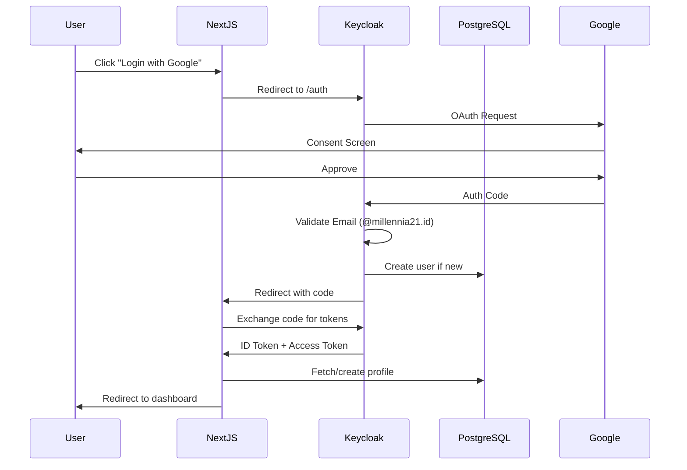

# Self-Hosted Architecture Plan for Reading Buddy

**Version:** 2.0.0  
**Date:** 2024-12-15  
**Status:** Planning Phase  
**Target:** Full Self-Hostable Solution with Dual Deployment Strategy

---

## Executive Summary

This document outlines the complete migration plan to make Reading Buddy fully self-hostable while maintaining backward compatibility with the managed SaaS version. The plan enables:

1. **Open Source Deployment:** Anyone can deploy Reading Buddy to their own infrastructure
2. **Managed SaaS:** Maintained Supabase-based deployment for paid customers
3. **Feature Parity:** Both deployments support identical features
4. **Easy Migration:** Users can migrate between self-hosted and managed versions

---

## 1. Current Supabase Dependencies Analysis

### Core Services to Replace

| Supabase Service | Current Usage | Replacement Strategy |
|------------------|---------------|---------------------|
| **PostgreSQL Database** | 19 tables, RLS, triggers, functions | PostgreSQL (direct) |
| **Auth** | Email/password, Google OAuth, sessions | Keycloak or Authentik |
| **Storage** | ❌ Not used | Already using MinIO ✅ |
| **Realtime** | ❌ Not actively used | Skip for now |
| **Edge Functions** | ❌ Not used | N/A |

### Critical Features to Preserve

1. **Row Level Security (RLS)** - 18 tables with complex policies
2. **Database Functions** - Gamification logic (XP, badges, streaks)
3. **Triggers** - Auto-profile creation, timestamp updates
4. **OAuth Integration** - Google OAuth with domain validation
5. **Session Management** - Cookie-based, server-side sessions
6. **Password Reset** - Email-based recovery flow
7. **Email Verification** - New user verification

---

## 2. Recommended Architecture

### Option A: PostgreSQL + Keycloak (Recommended)

**Pros:**
- Industry-standard, battle-tested
- Full OAuth 2.0/OIDC support (Google, GitHub, Microsoft, etc.)
- Built-in user federation, SSO
- Admin UI for user management
- Email verification, password reset
- Custom themes and branding
- Role-based access control (RBAC)
- Session management with JWT or cookies
- Active community, extensive documentation
- Docker-ready with official images

**Cons:**
- Java-based (heavier resource usage)
- More complex initial setup
- Requires separate service (3 containers: DB, App, Keycloak)

**Container Requirements:**
- PostgreSQL: ~200MB RAM
- Next.js App: ~512MB RAM
- Keycloak: ~512MB-1GB RAM
- **Total:** ~1.5-2GB RAM minimum

### Option B: PostgreSQL + Authentik (Alternative)

**Pros:**
- Modern, Python-based
- Beautiful admin UI (Django-based)
- Lighter than Keycloak (~300-400MB RAM)
- Built-in user self-service portal
- OIDC, SAML, LDAP support
- Advanced policy engine

**Cons:**
- Smaller community than Keycloak
- Fewer integrations
- Less mature (launched 2019 vs Keycloak 2014)

### Option C: PostgreSQL + Custom Auth (Not Recommended)

**Pros:**
- Full control, minimal dependencies
- Lighter resource footprint

**Cons:**
- High development effort (2-4 weeks)
- Security risks (DIY auth is dangerous)
- Missing features: OAuth, MFA, SSO
- Ongoing maintenance burden

---

## 3. Final Recommendation: PostgreSQL + Keycloak

**Why Keycloak:**
1. **Production-Ready:** Used by Red Hat, Cisco, Dell, thousands of enterprises
2. **Security:** FIPS 140-2 compliant, extensive security audits
3. **OAuth Compatibility:** Drop-in replacement for Supabase OAuth
4. **Extensible:** Custom authenticators, user storage providers
5. **Multi-Tenancy:** Future-proof for potential multi-school deployments

---

## 4. Database Migration Strategy

### Phase 1: Direct PostgreSQL Migration

**Goal:** Move from Supabase PostgreSQL to self-hosted PostgreSQL while preserving all features.

#### Database Setup

```yaml
# docker-compose.yml
services:
  postgres:
    image: postgres:16-alpine
    environment:
      POSTGRES_DB: reading_buddy
      POSTGRES_USER: reading_buddy
      POSTGRES_PASSWORD: ${DB_PASSWORD}
    volumes:
      - postgres_data:/var/lib/postgresql/data
      - ./sql/init:/docker-entrypoint-initdb.d
    ports:
      - "5432:5432"
    healthcheck:
      test: ["CMD-SHELL", "pg_isready -U reading_buddy"]
      interval: 10s
      timeout: 5s
      retries: 5
```

#### Migration Steps

1. **Export Supabase Schema**
   ```bash
   # Using Supabase CLI
   supabase db dump --schema public > schema.sql
   supabase db dump --schema auth > auth-schema.sql
   ```

2. **Transform RLS Policies**
   - Supabase RLS uses `auth.uid()` → Replace with session context
   - Rewrite policies to use `current_setting('app.user_id')::uuid`

3. **Preserve Database Functions**
   - All gamification functions migrate as-is (no Supabase dependencies)
   - `award_xp()`, `update_reading_streak()`, etc. are pure PostgreSQL

4. **Migrate Triggers**
   - `handle_new_user()` trigger changes (see Auth section)
   - Timestamp triggers migrate unchanged

#### RLS Policy Transformation Example

**Before (Supabase):**
```sql
CREATE POLICY "Students can view their own reading progress"
  ON student_books FOR SELECT
  USING (student_id = auth.uid());
```

**After (Self-Hosted):**
```sql
-- Using session variables set by middleware
CREATE POLICY "Students can view their own reading progress"
  ON student_books FOR SELECT
  USING (student_id = current_setting('app.user_id', true)::uuid);
```

#### Database Initialization Script

```sql
-- /sql/init/01-extensions.sql
CREATE EXTENSION IF NOT EXISTS "uuid-ossp";
CREATE EXTENSION IF NOT EXISTS "pgcrypto";

-- /sql/init/02-schema.sql
-- (Existing schema from database-setup.sql)

-- /sql/init/03-rls-policies.sql
-- (Transformed RLS policies)

-- /sql/init/04-functions.sql
-- (Gamification functions, triggers)

-- /sql/init/05-seed-data.sql
-- (Default badges, achievements)
```

### Phase 2: User Authentication Migration

**Challenge:** Supabase stores users in `auth.users` table with proprietary password hashing.

**Solution:** Two-tier migration strategy

#### Option 1: Export and Rehash (One-Time Migration)

```bash
# Export users from Supabase
supabase db dump --data-only --table auth.users > users.sql

# Transform script (Python)
python scripts/migrate-users.py
```

**Migration Script:**
```python
import bcrypt
import psycopg2
from supabase import create_client

# 1. Export users from Supabase
supabase = create_client(SUPABASE_URL, SERVICE_ROLE_KEY)
users = supabase.auth.admin.list_users()

# 2. Create users in Keycloak via Admin API
for user in users:
    keycloak.create_user({
        'username': user.email,
        'email': user.email,
        'emailVerified': user.email_confirmed_at is not None,
        'enabled': True,
        'credentials': [{
            'type': 'password',
            'value': generate_temp_password(),  # Force password reset
            'temporary': True
        }]
    })
    
    # 3. Update profiles table with Keycloak user ID
    db.execute(
        "UPDATE profiles SET keycloak_id = %s WHERE id = %s",
        (keycloak_user_id, user.id)
    )
```

**Post-Migration:**
- Send password reset emails to all users
- Users set new passwords on first login

#### Option 2: Gradual Migration (User-Initiated)

```typescript
// Dual authentication during transition period
async function authenticate(email: string, password: string) {
  // Try Keycloak first
  const keycloakResult = await keycloak.authenticate(email, password);
  if (keycloakResult.success) return keycloakResult;
  
  // Fallback to Supabase (legacy)
  const supabaseResult = await supabase.auth.signInWithPassword({ email, password });
  if (supabaseResult.data.user) {
    // Migrate user to Keycloak
    await migrateUserToKeycloak(supabaseResult.data.user, password);
    return supabaseResult;
  }
  
  return { error: 'Invalid credentials' };
}
```

---

## 5. Keycloak Integration Architecture

### Container Setup

```yaml
# docker-compose.yml
services:
  keycloak:
    image: quay.io/keycloak/keycloak:23.0
    environment:
      KC_DB: postgres
      KC_DB_URL: jdbc:postgresql://postgres:5432/keycloak
      KC_DB_USERNAME: keycloak
      KC_DB_PASSWORD: ${KEYCLOAK_DB_PASSWORD}
      KC_HOSTNAME: auth.reads.mws.web.id
      KEYCLOAK_ADMIN: admin
      KEYCLOAK_ADMIN_PASSWORD: ${KEYCLOAK_ADMIN_PASSWORD}
    command: start --optimized
    ports:
      - "8080:8080"
    depends_on:
      postgres:
        condition: service_healthy
```

### Keycloak Realm Configuration

**Realm:** `reading-buddy`

**Clients:**
1. **next-app** (Public client for Next.js frontend)
   - Client ID: `reading-buddy-app`
   - Access Type: `public`
   - Valid Redirect URIs: `https://reads.mws.web.id/*`
   - Web Origins: `https://reads.mws.web.id`
   - Direct Access Grants: Enabled (for email/password login)

2. **admin-cli** (Service account for backend)
   - Client ID: `reading-buddy-admin`
   - Access Type: `confidential`
   - Service Accounts Enabled: `true`

**Roles:**
- `STUDENT` (default)
- `TEACHER`
- `LIBRARIAN`
- `ADMIN`

**User Attributes:**
- `full_name` (mapped from Google OAuth)
- `grade` (custom field)
- `access_level` (custom field)
- `profile_id` (link to profiles table)

**Identity Providers:**
- Google OAuth (existing credentials)
  - Client ID: `${GOOGLE_OAUTH_CLIENT_ID}`
  - Client Secret: `${GOOGLE_OAUTH_CLIENT_SECRET}`
  - Hosted Domain: `millennia21.id` (domain validation)

### Authentication Flow



---

## 6. Next.js Integration Changes

### Dependencies

```json
{
  "dependencies": {
    "@keycloak/keycloak-admin-client": "^23.0.0",
    "keycloak-js": "^23.0.0",
    "next-auth": "^5.0.0"  // Alternative: Use NextAuth.js with Keycloak provider
  }
}
```

### Authentication Client

**Option 1: Direct Keycloak Integration**

```typescript
// lib/keycloak/client.ts
import Keycloak from 'keycloak-js';

export const keycloakConfig = {
  url: process.env.NEXT_PUBLIC_KEYCLOAK_URL || 'https://auth.reads.mws.web.id',
  realm: 'reading-buddy',
  clientId: 'reading-buddy-app',
};

export const keycloak = new Keycloak(keycloakConfig);

export async function initKeycloak() {
  const authenticated = await keycloak.init({
    onLoad: 'check-sso',
    silentCheckSsoRedirectUri: `${window.location.origin}/silent-check-sso.html`,
    pkceMethod: 'S256',
  });
  
  return authenticated;
}
```

**Option 2: NextAuth.js with Keycloak Provider (Recommended)**

```typescript
// app/api/auth/[...nextauth]/route.ts
import NextAuth from "next-auth";
import KeycloakProvider from "next-auth/providers/keycloak";

export const authOptions = {
  providers: [
    KeycloakProvider({
      clientId: process.env.KEYCLOAK_CLIENT_ID!,
      clientSecret: process.env.KEYCLOAK_CLIENT_SECRET!,
      issuer: process.env.KEYCLOAK_ISSUER, // https://auth.reads.mws.web.id/realms/reading-buddy
      
      // Profile mapping
      profile(profile) {
        return {
          id: profile.sub,
          email: profile.email,
          name: profile.name || profile.preferred_username,
          role: profile.realm_access?.roles?.find(r => 
            ['STUDENT', 'TEACHER', 'LIBRARIAN', 'ADMIN'].includes(r)
          ) || 'STUDENT',
        };
      },
    }),
  ],
  
  callbacks: {
    async jwt({ token, account, profile }) {
      if (account) {
        token.accessToken = account.access_token;
        token.refreshToken = account.refresh_token;
        token.role = profile.role;
      }
      return token;
    },
    
    async session({ session, token }) {
      session.user.role = token.role;
      session.accessToken = token.accessToken;
      return session;
    },
    
    async signIn({ user, account, profile }) {
      // Domain validation (replicate Supabase behavior)
      if (!user.email?.endsWith('@millennia21.id')) {
        return false; // Reject sign-in
      }
      
      // Create profile in database if first-time user
      await createOrUpdateProfile(user);
      
      return true;
    },
  },
  
  session: {
    strategy: 'jwt',
  },
};

const handler = NextAuth(authOptions);
export { handler as GET, handler as POST };
```

### Database Client Changes

**Before (Supabase):**
```typescript
import { createSupabaseServerClient } from '@/lib/supabase/server';

const supabase = await createSupabaseServerClient();
const { data: { user } } = await supabase.auth.getUser();
```

**After (Self-Hosted):**
```typescript
import { getServerSession } from 'next-auth';
import { authOptions } from '@/app/api/auth/[...nextauth]/route';
import { db } from '@/lib/db';

const session = await getServerSession(authOptions);
if (!session) redirect('/login');

// Set session context for RLS
await db.query('SET app.user_id = $1', [session.user.id]);

// Now queries respect RLS policies
const books = await db.query('SELECT * FROM books');
```

### Profile Creation Hook

**Keycloak Event Listener** (replaces `handle_new_user()` trigger)

```typescript
// lib/keycloak/hooks.ts
export async function createOrUpdateProfile(user: User) {
  const db = getDb();
  
  // Check if profile exists
  const existing = await db.query(
    'SELECT id FROM profiles WHERE keycloak_id = $1',
    [user.id]
  );
  
  if (existing.rows.length === 0) {
    // Create new profile (replicate Supabase trigger behavior)
    await db.query(`
      INSERT INTO profiles (
        id, keycloak_id, email, full_name, role, access_level,
        xp, level, reading_streak, longest_streak
      ) VALUES (
        gen_random_uuid(), $1, $2, $3, 'STUDENT', 'lower_elementary',
        0, 1, 0, 0
      )
    `, [user.id, user.email, user.name]);
  }
}
```

---

## 7. RLS Policy Implementation

### Session Context Middleware

```typescript
// middleware.ts
import { NextRequest, NextResponse } from 'next/server';
import { getToken } from 'next-auth/jwt';

export async function middleware(request: NextRequest) {
  const token = await getToken({ req: request });
  
  if (token) {
    // Set user context for RLS policies
    const response = NextResponse.next();
    response.headers.set('X-User-ID', token.sub!);
    response.headers.set('X-User-Role', token.role as string);
    return response;
  }
  
  return NextResponse.next();
}
```

### Database Connection Pool Configuration

```typescript
// lib/db/index.ts
import { Pool } from 'pg';

const pool = new Pool({
  host: process.env.DB_HOST || 'localhost',
  port: parseInt(process.env.DB_PORT || '5432'),
  database: process.env.DB_NAME || 'reading_buddy',
  user: process.env.DB_USER || 'reading_buddy',
  password: process.env.DB_PASSWORD,
  max: 20,
  idleTimeoutMillis: 30000,
  connectionTimeoutMillis: 2000,
});

// Helper to execute queries with RLS context
export async function queryWithContext(
  userId: string,
  query: string,
  params: any[] = []
) {
  const client = await pool.connect();
  try {
    // Set session variables for RLS
    await client.query('SET app.user_id = $1', [userId]);
    
    // Execute query (RLS policies apply)
    const result = await client.query(query, params);
    return result;
  } finally {
    client.release();
  }
}
```

---

## 8. Email Service Integration

### SMTP Configuration (Replaces Supabase Email)

```yaml
# docker-compose.yml
services:
  mailhog:  # For development
    image: mailhog/mailhog
    ports:
      - "1025:1025"  # SMTP
      - "8025:8025"  # Web UI
```

**Production Options:**
- **Postmark** (Recommended for SaaS)
- **SendGrid** (Popular choice)
- **Self-hosted Postfix** (Full control)
- **SMTP relay** (Google Workspace, etc.)

### Email Templates

```typescript
// lib/email/templates.ts
export const emailTemplates = {
  verification: (token: string, baseUrl: string) => ({
    subject: 'Verify your Reading Buddy account',
    html: `
      <p>Welcome to Reading Buddy!</p>
      <p>Click the link below to verify your email:</p>
      <a href="${baseUrl}/auth/verify?token=${token}">Verify Email</a>
    `,
  }),
  
  passwordReset: (token: string, baseUrl: string) => ({
    subject: 'Reset your Reading Buddy password',
    html: `
      <p>Click the link below to reset your password:</p>
      <a href="${baseUrl}/auth/reset-password?token=${token}">Reset Password</a>
      <p>If you didn't request this, ignore this email.</p>
    `,
  }),
};

// lib/email/sender.ts
import nodemailer from 'nodemailer';

const transporter = nodemailer.createTransport({
  host: process.env.SMTP_HOST,
  port: parseInt(process.env.SMTP_PORT || '587'),
  secure: process.env.SMTP_SECURE === 'true',
  auth: {
    user: process.env.SMTP_USER,
    pass: process.env.SMTP_PASSWORD,
  },
});

export async function sendEmail(to: string, subject: string, html: string) {
  await transporter.sendMail({
    from: process.env.SMTP_FROM || 'noreply@reads.mws.web.id',
    to,
    subject,
    html,
  });
}
```

**Keycloak Email Configuration:**
```properties
# Keycloak realm settings → Email
smtp.from=noreply@reads.mws.web.id
smtp.host=smtp.example.com
smtp.port=587
smtp.auth=true
smtp.user=smtp-user
smtp.password=smtp-password
smtp.starttls=true
```

---

## 9. Deployment Strategy

### Docker Compose Stack (Self-Hosted)

```yaml
version: '3.8'

services:
  postgres:
    image: postgres:16-alpine
    environment:
      POSTGRES_DB: reading_buddy
      POSTGRES_USER: reading_buddy
      POSTGRES_PASSWORD: ${DB_PASSWORD}
    volumes:
      - postgres_data:/var/lib/postgresql/data
      - ./sql/init:/docker-entrypoint-initdb.d
    healthcheck:
      test: ["CMD-SHELL", "pg_isready -U reading_buddy"]
      interval: 10s
      timeout: 5s
      retries: 5
    networks:
      - reading-buddy

  keycloak-db:
    image: postgres:16-alpine
    environment:
      POSTGRES_DB: keycloak
      POSTGRES_USER: keycloak
      POSTGRES_PASSWORD: ${KEYCLOAK_DB_PASSWORD}
    volumes:
      - keycloak_data:/var/lib/postgresql/data
    networks:
      - reading-buddy

  keycloak:
    image: quay.io/keycloak/keycloak:23.0
    environment:
      KC_DB: postgres
      KC_DB_URL: jdbc:postgresql://keycloak-db:5432/keycloak
      KC_DB_USERNAME: keycloak
      KC_DB_PASSWORD: ${KEYCLOAK_DB_PASSWORD}
      KC_HOSTNAME: ${KEYCLOAK_HOSTNAME:-auth.reads.mws.web.id}
      KC_PROXY: edge
      KEYCLOAK_ADMIN: ${KEYCLOAK_ADMIN:-admin}
      KEYCLOAK_ADMIN_PASSWORD: ${KEYCLOAK_ADMIN_PASSWORD}
    command: start --optimized
    ports:
      - "8080:8080"
    depends_on:
      keycloak-db:
        condition: service_started
    networks:
      - reading-buddy

  minio:
    image: minio/minio:latest
    command: server /data --console-address ":9001"
    environment:
      MINIO_ROOT_USER: ${MINIO_ACCESS_KEY}
      MINIO_ROOT_PASSWORD: ${MINIO_SECRET_KEY}
    volumes:
      - minio_data:/data
    ports:
      - "9000:9000"
      - "9001:9001"
    healthcheck:
      test: ["CMD", "curl", "-f", "http://localhost:9000/minio/health/live"]
      interval: 30s
      timeout: 20s
      retries: 3
    networks:
      - reading-buddy

  app:
    build:
      context: ./web
      dockerfile: Dockerfile
      args:
        NEXT_PUBLIC_APP_URL: ${NEXT_PUBLIC_APP_URL}
        NEXT_PUBLIC_KEYCLOAK_URL: ${NEXT_PUBLIC_KEYCLOAK_URL}
    environment:
      # Database
      DB_HOST: postgres
      DB_PORT: 5432
      DB_NAME: reading_buddy
      DB_USER: reading_buddy
      DB_PASSWORD: ${DB_PASSWORD}
      
      # Keycloak
      KEYCLOAK_ISSUER: ${KEYCLOAK_ISSUER}
      KEYCLOAK_CLIENT_ID: reading-buddy-app
      KEYCLOAK_CLIENT_SECRET: ${KEYCLOAK_CLIENT_SECRET}
      
      # MinIO
      MINIO_ENDPOINT: minio
      MINIO_PORT: 9000
      MINIO_USE_SSL: false
      MINIO_ACCESS_KEY: ${MINIO_ACCESS_KEY}
      MINIO_SECRET_KEY: ${MINIO_SECRET_KEY}
      MINIO_BUCKET_NAME: reading-buddy
      
      # Email (optional)
      SMTP_HOST: ${SMTP_HOST}
      SMTP_PORT: ${SMTP_PORT}
      SMTP_USER: ${SMTP_USER}
      SMTP_PASSWORD: ${SMTP_PASSWORD}
      
      # AI Provider
      AI_PROVIDER: ${AI_PROVIDER:-cloud}
      GOOGLE_GEMINI_API_KEY: ${GOOGLE_GEMINI_API_KEY}
      
      # NextAuth
      NEXTAUTH_URL: ${NEXT_PUBLIC_APP_URL}
      NEXTAUTH_SECRET: ${NEXTAUTH_SECRET}
    ports:
      - "3000:3000"
    depends_on:
      postgres:
        condition: service_healthy
      keycloak:
        condition: service_started
      minio:
        condition: service_healthy
    networks:
      - reading-buddy

volumes:
  postgres_data:
  keycloak_data:
  minio_data:

networks:
  reading-buddy:
    driver: bridge
```

### Environment Variables

```bash
# .env.example

# ===========================
# Database Configuration
# ===========================
DB_HOST=postgres
DB_PORT=5432
DB_NAME=reading_buddy
DB_USER=reading_buddy
DB_PASSWORD=your-secure-password-here

# ===========================
# Keycloak Configuration
# ===========================
KEYCLOAK_DB_PASSWORD=keycloak-db-password
KEYCLOAK_ADMIN=admin
KEYCLOAK_ADMIN_PASSWORD=admin-password
KEYCLOAK_HOSTNAME=auth.reads.mws.web.id
KEYCLOAK_ISSUER=https://auth.reads.mws.web.id/realms/reading-buddy
KEYCLOAK_CLIENT_ID=reading-buddy-app
KEYCLOAK_CLIENT_SECRET=your-keycloak-client-secret

# Public (for Next.js)
NEXT_PUBLIC_KEYCLOAK_URL=https://auth.reads.mws.web.id
NEXT_PUBLIC_APP_URL=https://reads.mws.web.id

# ===========================
# NextAuth Configuration
# ===========================
NEXTAUTH_URL=https://reads.mws.web.id
NEXTAUTH_SECRET=generate-with-openssl-rand-base64-32

# ===========================
# MinIO Configuration
# ===========================
MINIO_ENDPOINT=minio
MINIO_PORT=9000
MINIO_USE_SSL=false
MINIO_ACCESS_KEY=minioadmin
MINIO_SECRET_KEY=minioadmin
MINIO_BUCKET_NAME=reading-buddy

# ===========================
# Email Configuration (Optional)
# ===========================
SMTP_HOST=smtp.gmail.com
SMTP_PORT=587
SMTP_USER=your-email@gmail.com
SMTP_PASSWORD=your-app-password
SMTP_FROM=noreply@reads.mws.web.id

# ===========================
# AI Provider Configuration
# ===========================
AI_PROVIDER=cloud  # or 'local'
GOOGLE_GEMINI_API_KEY=your-gemini-api-key
NEXT_PUBLIC_RAG_API_URL=http://localhost:8000

# ===========================
# OAuth Configuration (Optional)
# ===========================
GOOGLE_OAUTH_CLIENT_ID=your-google-oauth-client-id
GOOGLE_OAUTH_CLIENT_SECRET=your-google-oauth-client-secret
```

---

## 10. Dual Deployment Strategy

### Architecture Overview

```
┌─────────────────────────────────────────────────────────────┐
│                    Reading Buddy Ecosystem                   │
├─────────────────────────────────────────────────────────────┤
│                                                               │
│  ┌──────────────────┐          ┌──────────────────┐         │
│  │  Self-Hosted     │          │  Managed SaaS    │         │
│  │  (Open Source)   │          │  (Paid Version)  │         │
│  └──────────────────┘          └──────────────────┘         │
│           │                             │                    │
│    ┌──────┴──────┐              ┌──────┴──────┐            │
│    │ PostgreSQL  │              │  Supabase   │            │
│    │ Keycloak    │              │  (Managed)  │            │
│    │ MinIO       │              │             │            │
│    │ Next.js     │              │  Next.js    │            │
│    └─────────────┘              └─────────────┘            │
│                                                               │
└─────────────────────────────────────────────────────────────┘
```

### Feature Comparison

| Feature | Self-Hosted (Free) | Managed SaaS (Paid) |
|---------|-------------------|---------------------|
| **Core Features** | ✅ Full access | ✅ Full access |
| **Database** | Self-managed PostgreSQL | Supabase (managed) |
| **Authentication** | Keycloak | Supabase Auth |
| **Storage** | Self-hosted MinIO | Managed MinIO/S3 |
| **AI Quizzes** | Cloud or Local RAG | Cloud (Gemini) |
| **Email** | Self-configured SMTP | Managed (Postmark) |
| **Backups** | Manual | Automated daily |
| **Support** | Community | Priority support |
| **Updates** | Self-managed | Auto-deployed |
| **Uptime SLA** | None | 99.9% guaranteed |
| **Multi-tenancy** | Single school | Multi-school support |
| **Custom domain** | ✅ | ✅ |
| **White-label** | ✅ | ✅ Premium tier |

### Code Abstraction Layer

**Database Abstraction:**
```typescript
// lib/db/adapter.ts
export interface DBAdapter {
  query(sql: string, params: any[]): Promise<QueryResult>;
  queryWithContext(userId: string, sql: string, params: any[]): Promise<QueryResult>;
}

// lib/db/postgres.ts (Self-hosted)
export class PostgresAdapter implements DBAdapter {
  async query(sql: string, params: any[]) {
    return pool.query(sql, params);
  }
  
  async queryWithContext(userId: string, sql: string, params: any[]) {
    const client = await pool.connect();
    await client.query('SET app.user_id = $1', [userId]);
    const result = await client.query(sql, params);
    client.release();
    return result;
  }
}

// lib/db/supabase.ts (Managed SaaS)
export class SupabaseAdapter implements DBAdapter {
  async query(sql: string, params: any[]) {
    return supabase.rpc('execute_sql', { query: sql, params });
  }
  
  async queryWithContext(userId: string, sql: string, params: any[]) {
    // Supabase handles RLS automatically via auth.uid()
    return this.query(sql, params);
  }
}

// lib/db/index.ts
export function getDBAdapter(): DBAdapter {
  if (process.env.DEPLOYMENT_MODE === 'self-hosted') {
    return new PostgresAdapter();
  } else {
    return new SupabaseAdapter();
  }
}
```

**Auth Abstraction:**
```typescript
// lib/auth/adapter.ts
export interface AuthAdapter {
  signIn(email: string, password: string): Promise<AuthResult>;
  signOut(): Promise<void>;
  getSession(): Promise<Session | null>;
  signInWithOAuth(provider: string): Promise<void>;
}

// lib/auth/keycloak.ts (Self-hosted)
export class KeycloakAuthAdapter implements AuthAdapter {
  async signIn(email: string, password: string) {
    const result = await keycloak.login({ username: email, password });
    return { user: result.user, session: result.session };
  }
  
  async signInWithOAuth(provider: string) {
    keycloak.login({ idpHint: provider });
  }
}

// lib/auth/supabase.ts (Managed SaaS)
export class SupabaseAuthAdapter implements AuthAdapter {
  async signIn(email: string, password: string) {
    const result = await supabase.auth.signInWithPassword({ email, password });
    return { user: result.data.user, session: result.data.session };
  }
  
  async signInWithOAuth(provider: string) {
    await supabase.auth.signInWithOAuth({ provider });
  }
}

// lib/auth/index.ts
export function getAuthAdapter(): AuthAdapter {
  if (process.env.DEPLOYMENT_MODE === 'self-hosted') {
    return new KeycloakAuthAdapter();
  } else {
    return new SupabaseAuthAdapter();
  }
}
```

### Build Configuration

```typescript
// next.config.js
const isSelfHosted = process.env.DEPLOYMENT_MODE === 'self-hosted';

module.exports = {
  env: {
    DEPLOYMENT_MODE: process.env.DEPLOYMENT_MODE || 'saas',
  },
  
  webpack: (config) => {
    if (isSelfHosted) {
      // Tree-shake Supabase dependencies
      config.resolve.alias['@/lib/supabase'] = '@/lib/db/postgres';
    }
    return config;
  },
};
```

---

## 11. Migration Roadmap

### Phase 1: Foundation (Week 1-2)

**Goals:**
- Set up PostgreSQL with schema migration
- Implement Keycloak deployment
- Create Docker Compose stack

**Tasks:**
1. ✅ Export Supabase schema and data
2. ✅ Transform RLS policies for PostgreSQL
3. ✅ Set up Keycloak realm and clients
4. ✅ Configure Google OAuth in Keycloak
5. ✅ Create database initialization scripts
6. ✅ Test Docker Compose deployment locally

**Deliverables:**
- `docker-compose.yml` for full stack
- SQL migration scripts
- Keycloak realm export (JSON)

### Phase 2: Authentication Integration (Week 3-4)

**Goals:**
- Replace Supabase Auth with Keycloak/NextAuth
- Implement profile synchronization
- Preserve session management

**Tasks:**
1. ✅ Install NextAuth.js with Keycloak provider
2. ✅ Implement auth callbacks (sign-in, JWT, session)
3. ✅ Create profile sync hooks
4. ✅ Migrate domain validation logic
5. ✅ Update all auth checks in codebase
6. ✅ Test OAuth flow end-to-end

**Deliverables:**
- Auth adapter pattern implementation
- Updated middleware for RLS context
- Migration guide for users

### Phase 3: Database Layer (Week 5-6)

**Goals:**
- Replace Supabase client with direct PostgreSQL
- Implement RLS with session context
- Preserve all database functions

**Tasks:**
1. ✅ Create database adapter interface
2. ✅ Implement PostgreSQL client with connection pooling
3. ✅ Update RLS policies for session variables
4. ✅ Test all gamification functions
5. ✅ Migrate all Supabase queries to adapters
6. ✅ Performance testing and optimization

**Deliverables:**
- Database adapter implementation
- Updated query patterns
- Performance benchmarks

### Phase 4: Testing & Documentation (Week 7-8)

**Goals:**
- Comprehensive testing of self-hosted version
- Create deployment documentation
- User migration guide

**Tasks:**
1. ✅ Unit tests for auth adapters
2. ✅ Integration tests for database layer
3. ✅ E2E tests for critical flows
4. ✅ Load testing (100+ concurrent users)
5. ✅ Write deployment guide
6. ✅ Create migration script for existing Supabase users

**Deliverables:**
- Test suite with >80% coverage
- Deployment documentation
- Migration automation scripts

### Phase 5: Dual Deployment (Week 9-10)

**Goals:**
- Maintain backward compatibility with Supabase
- Deploy self-hosted version to staging
- Soft launch for beta testers

**Tasks:**
1. ✅ Implement deployment mode switching
2. ✅ Test both self-hosted and SaaS modes
3. ✅ Deploy to staging environment
4. ✅ Beta testing with 10-20 users
5. ✅ Gather feedback and iterate
6. ✅ Prepare for public release

**Deliverables:**
- Dual-mode codebase
- Staging deployment
- Beta feedback report

### Phase 6: Public Release (Week 11-12)

**Goals:**
- Open source release
- Marketing launch
- Community building

**Tasks:**
1. ✅ Clean up repository, add LICENSE
2. ✅ Publish Docker images to GHCR
3. ✅ Create quick-start guide
4. ✅ Announce on social media, forums
5. ✅ Set up community channels (Discord, GitHub Discussions)
6. ✅ Monitor deployment issues

**Deliverables:**
- Public GitHub repository
- Quick-start documentation
- Community channels

---

## 12. Security Considerations

### Self-Hosted Security Checklist

- [ ] PostgreSQL password-protected with strong credentials
- [ ] Keycloak admin password changed from default
- [ ] All services behind reverse proxy (Nginx/Caddy)
- [ ] SSL/TLS certificates for all domains
- [ ] Firewall rules (allow only 80, 443, 22)
- [ ] Regular security updates (automated with Watchtower)
- [ ] Database backups encrypted and off-site
- [ ] Environment variables in secrets (not .env files in repo)
- [ ] Rate limiting on auth endpoints
- [ ] CORS policies restricted to app domain
- [ ] Content Security Policy (CSP) headers
- [ ] Regular penetration testing

### Keycloak Hardening

```yaml
# Production Keycloak configuration
services:
  keycloak:
    environment:
      # Database connection pooling
      KC_DB_POOL_INITIAL_SIZE: 10
      KC_DB_POOL_MAX_SIZE: 20
      KC_DB_POOL_MIN_SIZE: 5
      
      # Security headers
      KC_HTTP_HEADERS_STRICT_TRANSPORT_SECURITY: max-age=31536000; includeSubDomains
      KC_HTTP_HEADERS_X_FRAME_OPTIONS: DENY
      KC_HTTP_HEADERS_X_CONTENT_TYPE_OPTIONS: nosniff
      
      # Logging
      KC_LOG_LEVEL: info
      KC_LOG_CONSOLE_OUTPUT: json
      
      # Performance
      KC_CACHE: ispn
      KC_CACHE_STACK: kubernetes  # or tcp for Docker
```

---

## 13. Performance Optimization

### Database Optimization

```sql
-- Connection pooling (pgBouncer)
-- Add to docker-compose.yml
services:
  pgbouncer:
    image: pgbouncer/pgbouncer:latest
    environment:
      DATABASES_HOST: postgres
      DATABASES_PORT: 5432
      DATABASES_USER: reading_buddy
      DATABASES_PASSWORD: ${DB_PASSWORD}
      PGBOUNCER_POOL_MODE: transaction
      PGBOUNCER_MAX_CLIENT_CONN: 1000
      PGBOUNCER_DEFAULT_POOL_SIZE: 25
```

### Caching Strategy

```typescript
// lib/cache/redis.ts
import Redis from 'ioredis';

const redis = new Redis({
  host: process.env.REDIS_HOST || 'localhost',
  port: parseInt(process.env.REDIS_PORT || '6379'),
  password: process.env.REDIS_PASSWORD,
});

// Cache user profiles for 5 minutes
export async function getUserProfile(userId: string) {
  const cached = await redis.get(`profile:${userId}`);
  if (cached) return JSON.parse(cached);
  
  const profile = await db.query('SELECT * FROM profiles WHERE id = $1', [userId]);
  await redis.setex(`profile:${userId}`, 300, JSON.stringify(profile));
  
  return profile;
}
```

---

## 14. Cost Analysis

### Self-Hosted Infrastructure (Estimate)

**Minimum Requirements:**
- **CPU:** 2 cores
- **RAM:** 4GB
- **Storage:** 50GB SSD
- **Bandwidth:** 1TB/month

**Hosting Options:**

| Provider | Specs | Monthly Cost |
|----------|-------|--------------|
| **DigitalOcean Droplet** | 2 vCPU, 4GB RAM, 80GB SSD | $24/month |
| **Hetzner Cloud** | 2 vCPU, 4GB RAM, 80GB SSD | €9/month (~$10) |
| **AWS Lightsail** | 2 vCPU, 4GB RAM, 80GB SSD | $24/month |
| **Self-hosted** | Old laptop/server | $0/month (electricity ~$5) |

**Additional Services:**
- **Domain:** $12/year (~$1/month)
- **SSL Certificate:** Free (Let's Encrypt)
- **Email (SendGrid):** Free tier (100 emails/day)
- **Backups (S3):** ~$5/month (100GB)

**Total Self-Hosted Cost:** ~$15-30/month

### Managed SaaS Infrastructure (Current)

- **Supabase Pro:** $25/month
- **MinIO (DigitalOcean Spaces):** $5/month
- **Hosting (Komodo):** $0 (self-managed VPS)
- **Domain:** $12/year
- **Email (Postmark):** $10/month (10,000 emails)

**Total SaaS Cost:** ~$40-50/month

**Savings with Self-Hosting:** ~$20-30/month

---

## 15. Backup and Disaster Recovery

### Automated Backup Strategy

```bash
#!/bin/bash
# backup.sh - Daily database backup script

DATE=$(date +%Y%m%d_%H%M%S)
BACKUP_DIR="/backups"

# Backup PostgreSQL
docker exec reading-buddy-postgres pg_dump -U reading_buddy reading_buddy > \
  $BACKUP_DIR/db_backup_$DATE.sql

# Backup MinIO data
docker exec reading-buddy-minio mc mirror /data $BACKUP_DIR/minio_$DATE/

# Compress and encrypt
tar -czf - $BACKUP_DIR/*_$DATE* | \
  gpg --symmetric --cipher-algo AES256 > $BACKUP_DIR/backup_$DATE.tar.gz.gpg

# Upload to S3/B2
aws s3 cp $BACKUP_DIR/backup_$DATE.tar.gz.gpg \
  s3://reading-buddy-backups/

# Cleanup old backups (keep last 30 days)
find $BACKUP_DIR -name "backup_*.tar.gz.gpg" -mtime +30 -delete
```

**Cron Job:**
```cron
0 2 * * * /usr/local/bin/backup.sh
```

---

## 16. Monitoring and Observability

### Health Checks

```typescript
// app/api/health/route.ts
import { db } from '@/lib/db';

export async function GET() {
  try {
    // Check database
    await db.query('SELECT 1');
    
    // Check MinIO
    const minio = getMinioClient();
    await minio.listBuckets();
    
    // Check Keycloak (optional)
    const keycloak = await fetch(`${process.env.KEYCLOAK_URL}/health`);
    
    return Response.json({
      status: 'healthy',
      timestamp: new Date().toISOString(),
      services: {
        database: 'up',
        storage: 'up',
        auth: keycloak.ok ? 'up' : 'down',
      },
    });
  } catch (error) {
    return Response.json({
      status: 'unhealthy',
      error: error.message,
    }, { status: 503 });
  }
}
```

### Logging (Optional: Grafana + Loki)

```yaml
# docker-compose.monitoring.yml
services:
  loki:
    image: grafana/loki:latest
    ports:
      - "3100:3100"
    volumes:
      - ./loki-config.yml:/etc/loki/local-config.yaml
      - loki_data:/loki

  grafana:
    image: grafana/grafana:latest
    ports:
      - "3001:3000"
    environment:
      GF_SECURITY_ADMIN_PASSWORD: ${GRAFANA_PASSWORD}
    volumes:
      - grafana_data:/var/lib/grafana
```

---

## 17. Documentation Structure

```
docs/
├── deployment/
│   ├── self-hosted/
│   │   ├── quick-start.md
│   │   ├── production-deployment.md
│   │   ├── docker-compose.md
│   │   ├── kubernetes.md (future)
│   │   └── troubleshooting.md
│   ├── managed-saas/
│   │   ├── supabase-setup.md
│   │   └── managed-deployment.md
│   └── migration/
│       ├── supabase-to-self-hosted.md
│       ├── self-hosted-to-saas.md
│       └── data-export-import.md
├── configuration/
│   ├── environment-variables.md
│   ├── keycloak-setup.md
│   ├── database-setup.md
│   └── email-configuration.md
├── development/
│   ├── local-development.md
│   ├── architecture.md
│   └── contributing.md
└── user-guides/
    ├── admin-guide.md
    ├── teacher-guide.md
    └── student-guide.md
```

---

## 18. Open Source Strategy

### License: MIT

```
MIT License

Copyright (c) 2024 Reading Buddy Contributors

Permission is hereby granted, free of charge, to any person obtaining a copy...
```

**Why MIT:**
- Maximum permissiveness
- Allows commercial use
- Encourages adoption
- Compatible with paid SaaS offering

### Repository Structure

```
reading-buddy/
├── web/                  # Next.js application
├── sql/                  # Database migrations
├── docker/               # Docker configurations
│   ├── self-hosted/
│   └── development/
├── docs/                 # Documentation
├── scripts/              # Automation scripts
│   ├── backup.sh
│   ├── restore.sh
│   └── migrate-users.py
├── .github/
│   ├── workflows/        # CI/CD
│   └── ISSUE_TEMPLATE/
├── docker-compose.yml
├── docker-compose.prod.yml
├── LICENSE
├── README.md
├── CONTRIBUTING.md
└── CODE_OF_CONDUCT.md
```

### Contributing Guidelines

```markdown
# Contributing to Reading Buddy

We welcome contributions! Here's how you can help:

## Development Setup

1. Clone the repository
2. Copy `.env.example` to `.env`
3. Run `docker-compose up -d`
4. Run migrations: `npm run db:migrate`
5. Start development: `npm run dev`

## Code Style

- Use TypeScript strict mode
- Follow existing patterns
- Write tests for new features
- Run `npm run lint` before committing

## Pull Request Process

1. Fork the repository
2. Create a feature branch
3. Make your changes
4. Write/update tests
5. Submit a pull request
```

---

## 19. Marketing & Positioning

### Value Proposition

**Self-Hosted (Free & Open Source):**
- "Full control over your data and infrastructure"
- "Deploy to your own servers in minutes"
- "No vendor lock-in, no monthly fees"
- "Perfect for schools, libraries, and homeschoolers"

**Managed SaaS (Paid):**
- "Zero maintenance, focus on teaching"
- "99.9% uptime SLA with automated backups"
- "Priority support and feature requests"
- "Multi-school management (coming soon)"
- "Advanced analytics and reporting"

### Pricing Tiers (Proposed)

| Tier | Price | Features |
|------|-------|----------|
| **Self-Hosted** | Free | All core features, community support |
| **Starter** | $29/month | Up to 100 students, basic support |
| **Professional** | $99/month | Up to 500 students, priority support, advanced analytics |
| **Enterprise** | Custom | Unlimited students, multi-tenant, SLA, custom integrations |

---

## 20. Next Steps

### Immediate Actions

1. **Decision Point:** Approve this architecture plan
2. **Resource Allocation:** Assign developer hours (estimated 10-12 weeks)
3. **Infrastructure:** Provision staging environment for testing
4. **Communication:** Announce roadmap to existing users

### Risk Mitigation

**Technical Risks:**
- ✅ RLS policy migration complexity → Phased rollout with extensive testing
- ✅ Auth migration user experience → Gradual migration with fallback
- ✅ Performance regression → Benchmark testing before launch

**Business Risks:**
- ✅ Existing users confused by dual offerings → Clear communication, migration guide
- ✅ Support burden increases → Community-driven support for self-hosted
- ✅ Revenue impact → Managed SaaS differentiation with premium features

### Success Metrics

**Technical:**
- [ ] 100% feature parity between self-hosted and SaaS
- [ ] <10ms latency increase from Supabase baseline
- [ ] 99.9% uptime for self-hosted reference deployment

**Business:**
- [ ] 1,000+ self-hosted deployments in first year
- [ ] 50+ managed SaaS customers
- [ ] 80%+ user satisfaction score

---

## Conclusion

This architecture plan provides a comprehensive roadmap to transform Reading Buddy into a fully self-hostable platform while maintaining a competitive managed SaaS offering. The dual-deployment strategy balances:

- **Open source accessibility** for individual schools and cost-conscious users
- **Managed convenience** for institutions wanting zero-maintenance solutions
- **Technical excellence** with PostgreSQL + Keycloak as a robust foundation
- **Business sustainability** through clear differentiation and premium tiers

**Recommendation:** Proceed with **PostgreSQL + Keycloak + NextAuth.js** architecture in phased rollout starting with Phase 1 (Foundation) immediately.

---

**Document Version:** 1.0  
**Last Updated:** 2024-12-15  
**Next Review:** After Phase 1 completion (Week 2)  
**Author:** Development Team  
**Status:** Awaiting Approval
